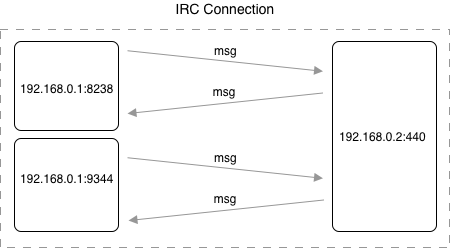
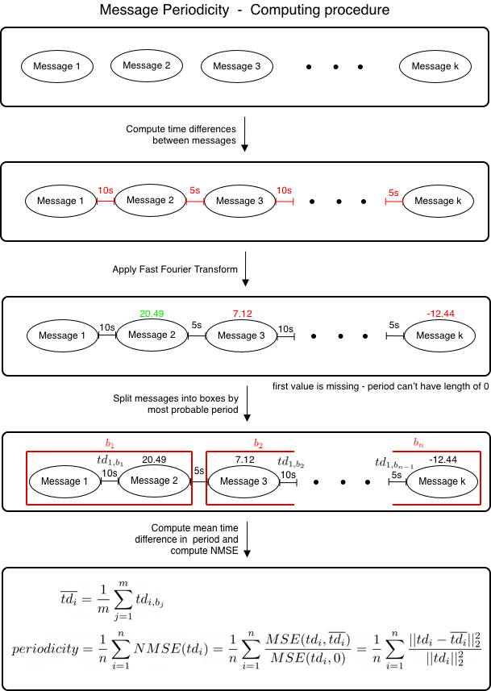

# IRC-Zeek-package
IRC Feature Extractor Zeek Package extends the functionality of Zeek network analysis framework. This package automatically recognizes IRC communication in a packet capture (pcap) file and automatically extract features from it.
The goal for the feature extraction is to describe an individual IRC communications that occur in the pcap file as accurately as possible.

## Installation
To install the package using [Zeek Package Manager](https://packages.zeek.org), run the following command:
```bash
$ zkg install IRC-Zeek-package
```
## Run
To extract the IRC features on the selected pcap file that contains IRC, run the following command in a terminal:
```bash
$ zeek IRC-Zeek-package -r file.pcap 
```
The output will be stored in  `irc_features.log` file in zeek log format. The log will look like this: 

```
#separator \x09
#set_separator	,
#empty_field	(empty)
#unset_field	-
#path	irc_features
#open	2020-01-27-21-54-41
#fields	src	src_ip	src_ports_count	dst	dst_ip	dst_port	start_time	end_time	duration	msg_count	size_total	periodicity	spec_chars_username_mean	spec_chars_msg_mean	msg_word_entropy
#types	string	addr	count	string	addr	port	time	time	double	count	int	double	double	double	double
T!T@null	192.168.100.103	4	#a925d765	111.230.241.23	2407	1532322898.819018	1534860900.996931	2538002.177913	23	48705	0.050294	0.25	0.908075	2.001506
T!T@null	192.168.100.103	33	#a925d765	185.61.149.22	2407	1530166710.153128	1535620500.535362	5453790.382234	231	562890	1.0	0.25	0.908256	2.276218
#close	2020-01-27-21-54-41

```

### Parsing log in Python

Instead of parsing the package manually, you can use the [ZAT](https://github.com/SuperCowPowers/zat) library  in Python to parse it directly into a Pandas data frame or as a list of dictionaries.

There is an example of how to parse the log as a list of dictionaries:


```python
import zat
from zat.log_to_dataframe import LogToDataFrame
from zat.bro_log_reader import BroLogReader


log_filename = 'irc_features.log'

logs_arr = []
reader = BroLogReader(log_filename)

for log in reader.readrows():
    # log is in dictionary format
    print(log)
    logs_arr.append(log) 
```

## Description
Once the data was obtained from network traffic capture, there was a process to extract the features. We separated the whole pcap into communications for each individual user. To do that, we separated communication into the connections between the source IP, destination IP, and destination port (hereinafter IRC connection). The source port is randomly chosen from the unregistered port range, and that is why the source port is not the same when a new TCP connection is established between the same IP addresses. For this reason, we neglected the source port to match the IRC connection with the same source IP, destination IP, and destination port. This is shown in figure below, where are two connections from the source IP address (192.168.0.1), to the same destination IP address (192.168.0.2) using different source port.




Example of IRC connection - IRC connection that is defined by source IP address 192.168.0.1, destination IP address 192.168.0.2, and destination port 440. Source port is neglected, and therefore one IRC connection can have multiple source ports. The IP addresses and ports are chosen randomly for demonstration purposes.

## Extracted Features
The feature selection is made manually to provide a good means of characterizing malicious communication. Features were computed for each IRC connection. Here is a final list of features that we used in our models.
### Total Packet Size
Size of all packets in bytes that were sent in IRC connection. It reflects how many messages were sent and how long they were.
### Session Duration
Duration of IRC connection in milliseconds - i.e., the difference between the time of the last message and the first message in IRC connection.
### Number of Messages
A total number of messages in IRC connection.
### Number of Source Ports
As we have mentioned before, the source port is neglected in unifying communication into IRC connections because the it is randomly chosen when a TCP connection is established. We suppose that artificial users could have had a higher number of source ports than the real users since the number of connections of the artificial users was higher than the number of connections of the real users.
### Message Periodicity
We suppose that artificial users (e.g., bots that are controlled by botnet master) use IRC for sending commands periodically, so we wanted to obtain that value. To do that, we created a method that would return a number between 0 and 1 - i.e. one if the message sequence is perfectly periodical, zero if the message sequence is not periodical at all.

To compute message periodicity, we firstly compute time differences between every message. On this computed sequence of numbers, we apply a fast Fourier transform (FFT). The output of FFT is a sequence of numbers. The higher the number on the given position of the output, the bigger the amplitude on the given position.Thus it has a more significant influence on the periodicity of the data.
The position of the largest element in the FFT's output represents the length of the period, which is the most significant from all other periods. 

To compute the quality of the most significant period, we split the data by length of that period.. Then we compute the normalised mean squared error (NMSE) that returns us the resulting number in the interval between 0 and 1 where 1 represents the perfectly periodic messages, and 0 represents not periodic messages at all.


Illustration of how message periodicity is computed. The time differences between messages and FFT output numbers are chosen randomly for demonstration purposes.

### Message Word Entropy
To consider whether the user sends the same message multiple times in a row, or whether the message contains a limited number of words, we compute a word entropy across all of the messages in the IRC connection. By the term word entropy we mean a measure of  words uncertainty in the message. For the computation of the word entropy, we use the formula below:


where n represents the number of words, and pi represents the probability that the word i will be used among all other words.
### Username Special Characters Mean
We want to obtain whether the username of the user in the IRC communication is random generated or not. Therefore, in this feature, we compute the average usage of non-alphabetic characters in the username.  

### Message Special Characters Mean
With this feature, we obtain the average usage of non-alphabetic characters across all messages in the IRC connection. We apply the same procedure of matching special characters for each message as in the previous case - we match non-alphabetic characters by regex, and then we divide the number of matched characters by the total number of message characters. Finally, we compute an average of all the obtained values for each message.
